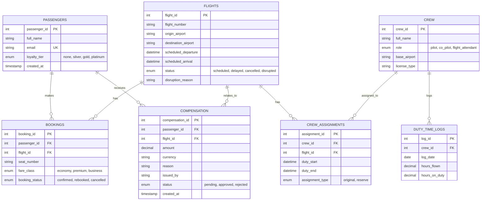

# Blue Horizon Airlines — IROPS Assistant (MCP Server)

## 1. The Company & the Problem

Blue Horizon Airlines is a mid-size international carrier (Cairo hub, routes into
Europe) that, like every airline, deals with **IROPS — Irregular Operations**:
mechanical delays, weather cancellations, crew shortages. When a flight goes
disrupted, front-desk ops agents have to, in minutes, check the flight, look up
every affected passenger, rebook them, assign reserve crew, issue compensation,
and get a passenger notice out — today all done by hand across multiple screens.

The naive fix is "just give the LLM a database connection and let it write
SQL." That's the failure mode we designed around: an agent (human or model)
could push a passenger onto an already-cancelled flight, assign a pilot past
their legal duty-time limit, or approve an unbounded compensation payout —
each of those has real regulatory and financial consequences, not just a bad
UX. So instead of raw DB access, the LLM only ever talks to an **MCP server**
that sits in front of the database and enforces the business rules itself,
independent of whatever the model decides to send.

**Two tools in particular carry real risk and are why this project needs the
full set of protocol concerns, not just "call a tool, get an answer":**
- `assign_reserve_crew` — a duty-time violation is a legal/safety issue, not a
  UX inconvenience.
- `issue_compensation` — money leaving the company above a threshold shouldn't
  be approved by an unsupervised agent (or a hallucinating model).

## 2. Database / ERD

SQLite/MySQL-style relational schema (see `db/` for schema + seed data + ERD
image/Mermaid source). Core entities:



Seed data covers both normal and edge cases each tool's validation depends on:
- `BH101` (CAI→JFK) is `scheduled` — a normal, unaffected flight to rebook onto.
- `BH202` (CAI→LHR) is `disrupted` (mechanical) — the primary IROPS case: a
  confirmed booking (Mona Khaled, business), an original crew assignment plus
  a reserve assignment, and an existing `approved` compensation record for
  Mona Khaled (`150.00 USD`) — used to demonstrate the duplicate-payout
  rejection in `issue_compensation`.
- `BH303` (HRG→DXB) is `cancelled` (weather) with its one booking already
  `cancelled` — an edge case with no confirmed passengers left, used to show
  `rebook_all_passengers_on_flight` correctly reporting "no confirmed
  bookings found" instead of erroring.
- `duty_time_logs` seeds Capt. Karim Mostafa (`crew_id=1`) right at the daily
  limits so assigning him as reserve crew genuinely triggers the elicitation
  pause (see `db/seed.sql` — set to `8.00` flying / `14.00` duty hours to hit
  the `>=` threshold exactly); Capt. Laila Hassan (`crew_id=2`) stays well
  under both limits as the "no elicitation needed" control case.

## 3. How Each Protocol Concern Shows Up

| Concern | Where it lives | Genuine trigger in our problem |
|---|---|---|
| **Capability negotiation** | `server.py` — `FastMCP(...)` declares tools/resources/prompts/elicitation/sampling during `initialize` | Client should not assume every server supports elicitation or sampling; ops agents connecting without a modern client still get the read-only tools safely |
| **Notifications** | `server.py: authenticate_supervisor` → `notifications_logic.py` | A front-desk session literally cannot see `assign_reserve_crew` / `issue_compensation` until a real supervisor authenticates mid-session — no reconnect, real `tools/list_changed` push |
| **Elicitation** | `tools_write.py: assign_reserve_crew`, `issue_compensation` → `elicitation_logic.py` | Duty-hour overage or compensation over $500 — the tool cannot safely decide alone, so it pauses via `ctx.elicit()` and waits on a real supervisor decision (approve/decline/cancel) |
| **Resources** | `server.py: duty_time_policy` (`policy://duty-time-limits`) | The duty-time policy is static reference data the model should *read once and reason over*, not a function to call repeatedly |
| **Prompts** | `server.py: draft_disruption_message` | A canned, parameterized starting point ("draft an apology for flight X, reason Y") so every client doesn't reinvent this prompt |
| **Sampling** | `sampling_logic.py: generate_disruption_notice` | The server needs a written passenger notice as part of a tool's own output, using real disruption data from the DB — it borrows the *connected client's* model via `ctx.session.create_message()`, not a model of its own |
| **Transport (both)** | `server.py` `if __name__ == "__main__"` block; `client/client_stdio.py` vs `client/client_http.py` | Built stdio first for local development (see early commits), moved to Streamable HTTP as default because Blue Horizon is multi-location and many ops agents' clients need to reach one shared server, not spawn a subprocess each |
| **Progress tracking** | `progress_logic.py: rebook_all_passengers_on_flight` | Rebooking every passenger on a cancelled flight one at a time genuinely takes a while — real `ctx.report_progress()` per passenger instead of one blocking response |
| **Defensive tool design** | `tools_write.py` (all write tools) | Typed, constrained schemas + business-rule validation independent of the schema (duty hours, duplicate compensation, double-booking) + handler-level authorization (`requested_by`/`issued_by` must look like `agent_###`) |

## 4. Repository Layout

```
mcp_server/      server.py, tools_read.py, tools_write.py, dbase.py,
                 elicitation_logic.py, notifications_logic.py,
                 sampling_logic.py, progress_logic.py
db/              schema, seed data, ERD
client/          client_stdio.py (dev), client_http.py (deployed)
README.md
```

## 5. Running It

**Server (dev, stdio):**
```
cd mcp_server
python server.py stdio
```

**Server (deployed default, Streamable HTTP):**
```
cd mcp_server
python server.py
```

**Client (dev):**
```
cd client
python client_stdio.py
```
Connects over stdio, prints the tool list before and after supervisor
authentication, and exercises the read/write/notification paths.

**Client (HTTP):**
```
cd client
python client_http.py
```
Talks to a running Streamable HTTP server instance instead of spawning a
subprocess — this is the path a real multi-agent deployment would use.

Both clients require a `.env` (see `mcp_server/.env.example`, never commit the
real one) with the database credentials `dbase.py` reads via `os.getenv`.

## 6. Comparison Note: Read-Only vs. Write, and What If a Capability Is Missing

| Tool | Type | Elicitation? | Why |
|---|---|---|---|
| `get_flight_status` | Read-only | No | No state change, safe by nature |
| `get_passenger_booking` | Read-only | No | No state change |
| `rebook_passenger` | Write | No | Validated deterministically (flight status, no double-booking) — no judgment call for a human |
| `rebook_all_passengers_on_flight` | Write | No | Same validation as above, just batched — reports progress, not a decision point |
| `generate_disruption_notice` | Read (side-effect: drafts text) | No (uses sampling instead) | Needs a model to write prose, not a human to decide |
| `assign_reserve_crew` | Write | **Yes**, when duty-hour limits would be exceeded | A legal/safety limit — only a supervisor should be able to override it |
| `issue_compensation` | Write | **Yes**, when amount > $500 | A financial threshold — large payouts need explicit sign-off |
| `authenticate_supervisor` | State-changing (session role) | No | Gate itself, not a gated action |

**If a client connects without elicitation support:** `assign_reserve_crew`
and `issue_compensation` would have no way to surface the approval prompt.
Rather than silently proceeding (a supervisor override happening with nobody
actually consenting) or silently failing with no explanation, the design
intent is that a client lacking elicitation should not be offered these two
tools at all — the same gate that hides them from an unauthenticated
front-desk session applies to a client that can't honor a human-in-the-loop
pause. Read-only tools and the deterministic write tools (`rebook_passenger`)
remain fully usable regardless.

**If a client connects without sampling support:** `generate_disruption_notice`
degrades — the static `draft_disruption_message` prompt template is still
available as a fallback the host's own model can fill in.

## 7. Where It Stands Now / What We'd Worry About in Production

- A supervisor's approval to override a duty-hour limit is currently returned
  only as text in the tool's response — it isn't written back into
  `duty_time_logs` as a flag. In production we'd want an auditable record of
  *which* overrides happened and who approved them, queryable later, not just
  a string in a chat transcript.
- `session_state` in `notifications_logic.py` is a single shared dict — fine
  for this single-connection demo, but a real multi-agent deployment over
  Streamable HTTP needs per-session authentication state, not one shared flag.
- Hardcoded demo supervisor credentials (`notifications_logic.py`) are only
  acceptable because this is a class project; production would need real
  auth, not a PIN dictionary in source.
