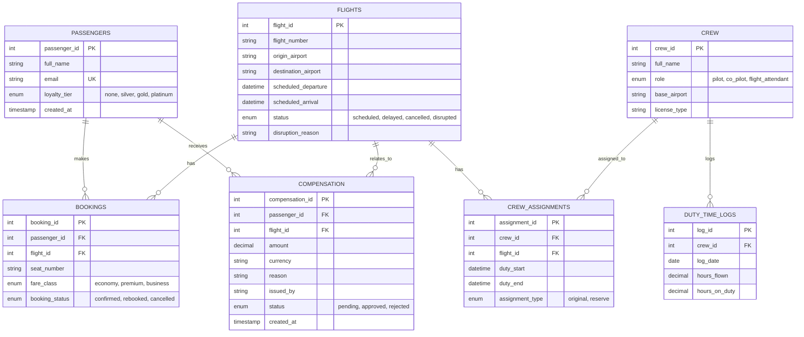

# Blue Horizon Airlines — IROPS Assistant (MCP Server)

## 1. The Company & the Problem

Blue Horizon Airlines is a mid-size international carrier (Cairo hub, routes into
Europe) that, like every airline, deals with **IROPS — Irregular Operations**:
mechanical delays, weather cancellations, crew shortages. When a flight goes
disrupted, front-desk ops agents have to, in minutes, check the flight, look up
every affected passenger, rebook them, assign reserve crew, issue compensation,
and get a passenger notice out — today all done by hand across multiple screens.

The naive fix is "just give the LLM a database connection and let it write
SQL." That's the failure mode we designed around: an agent (human or model)
could push a passenger onto an already-cancelled flight, assign a pilot past
their legal duty-time limit, or approve an unbounded compensation payout —
each of those has real regulatory and financial consequences, not just a bad
UX. So instead of raw DB access, the LLM only ever talks to an **MCP server**
that sits in front of the database and enforces the business rules itself,
independent of whatever the model decides to send.

**Two tools in particular carry real risk and are why this project needs the
full set of protocol concerns, not just "call a tool, get an answer":**
- `assign_reserve_crew` — a duty-time violation is a legal/safety issue, not a
  UX inconvenience.
- `issue_compensation` — money leaving the company above a threshold shouldn't
  be approved by an unsupervised agent (or a hallucinating model).

## 2. Database / ERD

SQLite/MySQL-style relational schema (see `db/` for schema + seed data + ERD
image/Mermaid source). Core entities:



Seed data covers both normal and edge cases each tool's validation depends on:
- `BH101` (CAI→JFK) is `scheduled` — a normal, unaffected flight to rebook onto.
- `BH202` (CAI→LHR) is `disrupted` (mechanical) — the primary IROPS case: a
  confirmed booking (Mona Khaled, business), an original crew assignment plus
  a reserve assignment, and an existing `approved` compensation record for
  Mona Khaled (`150.00 USD`) — used to demonstrate the duplicate-payout
  rejection in `issue_compensation`.
- `BH303` (HRG→DXB) is `cancelled` (weather) with its one booking already
  `cancelled` — an edge case with no confirmed passengers left, used to show
  `rebook_all_passengers_on_flight` correctly reporting "no confirmed
  bookings found" instead of erroring.
- `duty_time_logs` seeds Capt. Karim Mostafa (`crew_id=1`) right at the daily
  limits so assigning him as reserve crew genuinely triggers the elicitation
  pause (see `db/seed.sql` — set to `8.00` flying / `14.00` duty hours to hit
  the `>=` threshold exactly); Capt. Laila Hassan (`crew_id=2`) stays well
  under both limits as the "no elicitation needed" control case.

## 3. How Each Protocol Concern Shows Up

| Concern | Where it lives | Genuine trigger in our problem |
|---|---|---|
| **Capability negotiation** | `server.py` — `FastMCP(...)` declares tools/resources/prompts/elicitation/sampling during `initialize` | Client should not assume every server supports elicitation or sampling; ops agents connecting without a modern client still get the read-only tools safely |
| **Notifications** | `server.py: authenticate_supervisor` → `notifications_logic.py` | A front-desk session literally cannot see `assign_reserve_crew` / `issue_compensation` until a real supervisor authenticates mid-session — no reconnect, real `tools/list_changed` push |
| **Elicitation** | `tools_write.py: assign_reserve_crew`, `issue_compensation` → `elicitation_logic.py` | Duty-hour overage or compensation over $500 — the tool cannot safely decide alone, so it pauses via `ctx.elicit()` and waits on a real supervisor decision (approve/decline/cancel) |
| **Resources** | `server.py: duty_time_policy` (`policy://duty-time-limits`) | The duty-time policy is static reference data the model should *read once and reason over*, not a function to call repeatedly |
| **Prompts** | `server.py: draft_disruption_message` | A canned, parameterized starting point ("draft an apology for flight X, reason Y") so every client doesn't reinvent this prompt |
| **Sampling** | `sampling_logic.py: generate_disruption_notice` | The server needs a written passenger notice as part of a tool's own output, using real disruption data from the DB — it borrows the *connected client's* model via `ctx.session.create_message()`, not a model of its own |
| **Transport (both)** | `server.py` `if __name__ == "__main__"` block; `client/client_stdio.py` vs `client/client_http.py` | Built stdio first for local development (see early commits), moved to Streamable HTTP as default because Blue Horizon is multi-location and many ops agents' clients need to reach one shared server, not spawn a subprocess each |
| **Progress tracking** | `progress_logic.py: rebook_all_passengers_on_flight` | Rebooking every passenger on a cancelled flight one at a time genuinely takes a while — real `ctx.report_progress()` per passenger instead of one blocking response |
| **Defensive tool design** | `tools_write.py` (all write tools) | Typed, constrained schemas + business-rule validation independent of the schema (duty hours, duplicate compensation, double-booking) + handler-level authorization (`requested_by`/`issued_by` must look like `agent_###`) |

## 4. Repository Layout

```
mcp_server/      server.py, tools_read.py, tools_write.py, dbase.py,
                 elicitation_logic.py, notifications_logic.py,
                 sampling_logic.py, progress_logic.py
db/              schema, seed data, ERD
client/          client_stdio.py (dev), client_http.py (deployed)
README.md
```

## 5. Running It

**Server (dev, stdio):**
```
cd mcp_server
python server.py stdio
```

**Server (deployed default, Streamable HTTP):**
```
cd mcp_server
python server.py
```

**Client (dev):**
```
cd client
python client_stdio.py
```
Connects over stdio, prints the tool list before and after supervisor
authentication, and exercises the read/write/notification paths.

**Client (HTTP):**
```
cd client
python client_http.py
```
Talks to a running Streamable HTTP server instance instead of spawning a
subprocess — this is the path a real multi-agent deployment would use.

Both clients require a `.env` (see `mcp_server/.env.example`, never commit the
real one) with the database credentials `dbase.py` reads via `os.getenv`.

## 6. Comparison Note: Read-Only vs. Write, and What If a Capability Is Missing

| Tool | Type | Elicitation? | Why |
|---|---|---|---|
| `get_flight_status` | Read-only | No | No state change, safe by nature |
| `get_passenger_booking` | Read-only | No | No state change |
| `rebook_passenger` | Write | No | Validated deterministically (flight status, no double-booking) — no judgment call for a human |
| `rebook_all_passengers_on_flight` | Write | No | Same validation as above, just batched — reports progress, not a decision point |
| `generate_disruption_notice` | Read (side-effect: drafts text) | No (uses sampling instead) | Needs a model to write prose, not a human to decide |
| `assign_reserve_crew` | Write | **Yes**, when duty-hour limits would be exceeded | A legal/safety limit — only a supervisor should be able to override it |
| `issue_compensation` | Write | **Yes**, when amount > $500 | A financial threshold — large payouts need explicit sign-off |
| `authenticate_supervisor` | State-changing (session role) | No | Gate itself, not a gated action |

**If a client connects without elicitation support:** `assign_reserve_crew`
and `issue_compensation` would have no way to surface the approval prompt.
Rather than silently proceeding (a supervisor override happening with nobody
actually consenting) or silently failing with no explanation, the design
intent is that a client lacking elicitation should not be offered these two
tools at all — the same gate that hides them from an unauthenticated
front-desk session applies to a client that can't honor a human-in-the-loop
pause. Read-only tools and the deterministic write tools (`rebook_passenger`)
remain fully usable regardless.

**If a client connects without sampling support:** `generate_disruption_notice`
degrades — the static `draft_disruption_message` prompt template is still
available as a fallback the host's own model can fill in.

## 7. Where It Stands Now / What We'd Worry About in Production

- A supervisor's approval to override a duty-hour limit is currently returned
  only as text in the tool's response — it isn't written back into
  `duty_time_logs` as a flag. In production we'd want an auditable record of
  *which* overrides happened and who approved them, queryable later, not just
  a string in a chat transcript.
- `session_state` in `notifications_logic.py` is a single shared dict — fine
  for this single-connection demo, but a real multi-agent deployment over
  Streamable HTTP needs per-session authentication state, not one shared flag.
- Hardcoded demo supervisor credentials (`notifications_logic.py`) are only
  acceptable because this is a class project; production would need real
  auth, not a PIN dictionary in source.


# Blue Horizon IROPS Assistant — Memory & RAG Lab

Extension of the Blue Horizon Airlines MCP Server Lab.

This project adds two major capabilities to the existing IROPS Assistant:

1. **Long-term memory** for preserving useful information across an ongoing disruption workflow.
2. **Retrieval-grounded policy knowledge** using RAG, hybrid retrieval, agentic retrieval, and Self-RAG-style verification.

The project also includes evaluation components for context-management strategies and RAG architectures.

---

# 1. Project Problem

Blue Horizon Airlines' IROPS Assistant already has DB-backed operational tools such as:

* `get_flight_status`
* `get_passenger_booking`
* `rebook_passenger`
* `rebook_all_passengers_on_flight`
* `assign_reserve_crew`
* `issue_compensation`
* `generate_disruption_notice`

Two major problems appear during realistic disruption workflows.

## 1.1 Context gets buried

During a large disruption, an operations agent may perform many tool calls:

* checking flights,
* checking passenger bookings,
* rebooking passengers,
* checking crew availability,
* checking duty-time limits,
* issuing compensation.

Important information from an earlier conversation can become buried under later tool output.

For example, a passenger may have an important connecting flight, but that information can disappear from the active context after many subsequent operations.

The `memory/` and `context_eval/` components address this problem.

## 1.2 Policy knowledge is not sufficiently exposed

The original MCP server exposed only a short duty-time resource containing the basic:

* 8-hour flying limit
* 14-hour duty limit

However, real policy decisions require much more information:

* compensation eligibility,
* distance and delay tiers,
* extraordinary-circumstance exceptions,
* mechanical-failure distinctions,
* supervisor overrides,
* reserve-crew activation rules,
* loyalty-tier adjustments.

The `rag/` and retrieval components provide this policy knowledge without requiring every rule to become a separate hardcoded tool.

---

# 2. Repository Structure

```text
BlueHorizonAirlineC_Memory_Rag/
│
├── agent/
│   ├── client_http.py
│   ├── client_stdio.py
│   └── rag_integration.py
│
├── context_eval/
│   ├── run_comparison.py
│   ├── strategies.py
│   └── test_transcripts/
│
├── database/
│   └── database files / setup
│
├── mcp_server/
│   ├── dbase.py
│   ├── elicitation_logic.py
│   ├── keyword_search.py
│   ├── notifications_logic.py
│   ├── progress_logic.py
│   ├── rag_tool.py
│   ├── sampling_logic.py
│   ├── Server.py
│   ├── tools_read.py
│   ├── tools_search.py
│   └── tools_write.py
│
├── memory/
│   ├── short_term.py
│   ├── scratchpad.py
│   ├── episodic_store.py
│   ├── routing.py
│   ├── semantic_store.py
│   └── consolidation.py
│
├── rag/
│   ├── agentic_rag.py
│   ├── chunking.py
│   ├── compensation_policy.md
│   ├── duty_time_policy.md
│   ├── embeddings.py
│   ├── hybrid_search.py
│   ├── ingest.py
│   ├── keyword_index.py
│   ├── llm_client.py
│   ├── naive_rag.py
│   ├── self_rag_verify.py
│   └── vector_store.py
│
├── retrieval_eval/
│   ├── run_comparison.py
│   └── test_questions/
│
└── README.md
```

---

# 3. RAG / Retrieval Layer

## 3.1 Policy Manuals

The RAG knowledge base contains two policy manuals:

### `compensation_policy.md`

Contains rules covering:

* compensation eligibility,
* compensation amounts,
* distance and delay tiers,
* cancellation rules,
* missed connections,
* extraordinary circumstances,
* mechanical-failure distinctions,
* supervisor approval,
* loyalty-tier adjustments,
* audit requirements.

### `duty_time_policy.md`

Contains rules covering:

* daily duty limits,
* flying limits,
* reserve crew activation,
* supervisor overrides,
* license-specific rules,
* international routes,
* crew assignment conditions.

The documents are divided into numbered clauses such as `4.2b` and `5.2`.

This allows retrieval to return precise policy clauses rather than entire manuals.

---

# 4. Chunking and Embeddings

## `rag/chunking.py`

The chunker is section/sub-clause aware.

Each chunk contains metadata such as:

```text
source
doc_type
section
clause
last_reviewed
```

This preserves clause identifiers and makes policy-specific retrieval more precise.

## `rag/embeddings.py`

The project uses a local `HashingVectorizer` backend from scikit-learn.

The embedding configuration is:

```text
384 dimensions
local computation
no API key required
no external embedding service required
```

This keeps ingestion reproducible and allows the RAG pipeline to run offline.

---

# 5. Vector Store

## `rag/vector_store.py`

Chroma is used as the persistent vector database.

The vector store uses:

* Chroma `PersistentClient`
* HNSW approximate-nearest-neighbor indexing
* cosine similarity
* metadata attached to every chunk
* metadata filtering through Chroma

The generated vector database is rebuilt from the policy documents using `ingest.py`.

The current policy corpus produces:

```text
47 chunks total
27 compensation-policy chunks
20 duty-time-policy chunks
```

---

# 6. Ingestion Pipeline

## `rag/ingest.py`

The ingestion process is:

```text
Policy Markdown files
        ↓
Chunking
        ↓
Metadata attachment
        ↓
Embedding
        ↓
Chroma upsert
        ↓
Queryable vector store
```

Run:

```powershell
python rag/ingest.py
```

After ingestion, the vector store should report approximately:

```text
47 chunks
```

---

# 7. RAG Architectures

Three retrieval architectures were implemented against the same policy corpus.

| Architecture | Implementation         | Mechanism                                            |
| ------------ | ---------------------- | ---------------------------------------------------- |
| Naive RAG    | `rag/naive_rag.py`     | ANN/vector retrieval → answer                        |
| Hybrid RAG   | `rag/hybrid_search.py` | ANN + BM25 → Reciprocal Rank Fusion                  |
| Agentic RAG  | `rag/agentic_rag.py`   | retrieve → reason → retrieve again, capped at 3 hops |

## 7.1 Naive RAG

Naive RAG performs vector-based retrieval and generates an answer from the retrieved chunks.

It is simple and fast, but can return semantically similar content from the wrong policy manual.

## 7.2 Hybrid RAG

Hybrid RAG combines:

* vector/ANN retrieval
* BM25 keyword retrieval

The results are merged using Reciprocal Rank Fusion.

This is particularly useful for policy questions containing exact clause identifiers such as:

```text
4.2b
5.2
3.1
```

## 7.3 Agentic RAG

Agentic RAG performs multiple retrieval hops.

The first retrieval is used to determine what information is still needed, after which another query can be generated and retrieved.

The implementation limits the process to a maximum of three hops.

---

# 8. Observed Retrieval Failure

A real test demonstrated why hybrid retrieval is useful.

For:

> What does clause 4.2b say about mechanical failure compensation?

The vector-only top result was:

```text
duty_time_policy:sec3:3.2
```

which was the wrong policy manual.

The keyword-only result was:

```text
compensation_policy:sec4:4.2b
```

which was the correct clause.

This demonstrates that semantic similarity alone can retrieve the wrong policy, while exact policy identifiers are handled much better by keyword retrieval.

Hybrid retrieval combines both signals.

---

# 9. Retrieval Evaluation

The retrieval evaluation compares the three RAG architectures using the project's domain-specific test set.

Run:

```powershell
cd retrieval_eval
python run_comparison.py
```

Observed results:

| RAG Architecture | Avg Accuracy (%) | Avg Tokens / Query | Avg Latency / Query (s) |
| ---------------- | ---------------: | -----------------: | ----------------------: |
| Naive            |            30.30 |                 24 |                0.000028 |
| Hybrid           |            60.61 |                 26 |                0.000009 |
| Agentic          |            39.39 |                 45 |                0.000003 |

### Selected architecture: Hybrid

Hybrid retrieval achieved the highest measured accuracy:

```text
60.61%
```

while using only slightly more tokens than Naive RAG.

Therefore, **Hybrid RAG is the default retrieval architecture used by the agent integration.**

---

# 10. Self-RAG-Style Verification

## `rag/self_rag_verify.py`

Retrieval results are not automatically trusted.

The system performs two explicit verification stages.

## 10.1 Post-Retrieval Relevance Check

Every retrieved chunk is evaluated for relevance to the query.

```text
Query
 ↓
Retrieved chunks
 ↓
Relevance judge
 ↓
Relevant chunks kept
Irrelevant chunks dropped
```

Irrelevant chunks are removed before the answer is trusted.

## 10.2 Post-Generation Support Check

After generation, the answer is checked against the surviving relevant chunks.

```text
Relevant context
 ↓
Generated answer
 ↓
Support judge
 ↓
Supported → return answer
Unsupported → fallback response
```

## 10.3 Failure Behavior

If no retrieved chunk is relevant, the system does not return a guessed answer.

Instead it returns:

```text
I don't have enough grounded information in the policy manuals to
answer that confidently. Please escalate to a supervisor or Flight
Ops / Passenger Relations rather than relying on this answer.
```

The verification decision is also recorded in:

```text
VERIFICATION_LOG
```

### Demonstrated failure case

The following query cannot be answered by the policy corpus:

```text
What is the CEO's personal cell phone number?
```

The retrieved chunks were judged irrelevant and the verification gate failed.

The final answer shown to the user was the fallback response rather than an invented phone number.

---

# 11. Agent RAG Integration

## `agent/rag_integration.py`

This is the main integration point for policy questions.

The flow is:

```text
Policy question
      ↓
Hybrid retrieval
      ↓
Self-RAG relevance check
      ↓
Answer generation
      ↓
Support check
      ↓
Grounded answer OR fallback
```

Example successful query:

```text
What does clause 4.2b say about mechanical failure compensation?
```

Result:

```text
grounded=True
architecture=hybrid_search
```

For an unsupported question:

```text
What is the CEO's personal cell phone number?
```

Result:

```text
grounded=False
architecture=hybrid_search
```

and the fallback response is returned.

---

# 12. MCP RAG Integration

The MCP server exposes:

```text
answer_policy_question
```

This tool accepts:

```text
question
policy_area
```

where `policy_area` can be:

```text
compensation
duty_time
any
```

The tool routes policy questions through the RAG integration rather than duplicating retrieval logic inside the MCP server.

The existing:

```text
policy://duty-time-limits
```

resource remains useful for quick access to the basic 8h / 14h limits.

The new RAG tool handles more complicated cases such as:

* exceptions,
* sub-clauses,
* compensation eligibility,
* override conditions.

---

# 13. Memory Layer

## `memory/`

The Memory layer addresses the problem of important information being lost during long IROPS conversations.

The implementation contains:

```text
short_term.py
scratchpad.py
episodic_store.py
semantic_store.py
routing.py
consolidation.py
```

## Main responsibilities

### Short-term memory

Keeps the current working conversation state.

### Scratchpad

Maintains temporary working information needed while solving the current disruption.

### Episodic memory

Stores event-specific experiences and past disruption episodes.

### Semantic memory

Stores information that is useful beyond a single event.

### Routing

Determines where information should be stored or recalled.

### Consolidation

Promotes useful information and handles memory consolidation/conflict resolution.

The Memory component was smoke-tested independently and the individual memory modules executed successfully.

---

# 14. Shared Self-RAG Verification for Memory

The same verification functions used by RAG are designed to be reusable for memory recall:

```text
judge_relevance()
judge_support()
```

This avoids having two separate verification implementations.

The design therefore supports:

```text
RAG retrieval
      ↓
Self-RAG verification

Memory retrieval
      ↓
Same verification functions
```

This ensures recalled information is also subject to relevance/support checking before being trusted.

---

# 15. Context Management Evaluation

## `context_eval/`

Four context-management strategies were implemented:

1. `sliding_window`
2. `observation_masking`
3. `recursive_summarization`
4. `zone_based_pruning`

Run:

```powershell
cd context_eval
python run_comparison.py
```

Observed results:

| Strategy                | Avg Accuracy (%) | Avg Tokens | Avg Latency (s) |
| ----------------------- | ---------------: | ---------: | --------------: |
| Sliding Window          |            16.67 |        336 |        0.000061 |
| Observation Masking     |            50.00 |       1410 |        0.000137 |
| Recursive Summarization |            50.00 |       1053 |        0.000166 |
| Zone-Based Pruning      |            50.00 |       1021 |        0.000128 |

## Strategy descriptions

### Sliding Window

Keeps:

* system prompt,
* first user message,
* latest conversation turns.

### Observation Masking

Preserves the conversation while limiting oversized tool outputs.

### Recursive Summarization

Compresses historical messages into deterministic summaries while preserving the latest turns.

### Zone-Based Pruning

Preserves important initial instructions and recent context while pruning or compressing middle tool-heavy sections.

Based on the observed evaluation, **Zone-Based Pruning** provides the best balance among the strategies that reached the top measured accuracy, while using fewer tokens than Observation Masking and Recursive Summarization.

---

# 16. MCP Server

## `mcp_server/`

The MCP server provides the operational interface for the airline assistant.

Main components include:

```text
Server.py
dbase.py
tools_read.py
tools_write.py
tools_search.py
rag_tool.py
sampling_logic.py
progress_logic.py
notifications_logic.py
elicitation_logic.py
keyword_search.py
```

## Read tools

Examples:

```text
get_flight_status
get_passenger_booking
```

## Write tools

Examples:

```text
rebook_passenger
rebook_all_passengers_on_flight
assign_reserve_crew
issue_compensation
```

## RAG tool

```text
answer_policy_question
```

## Additional MCP capabilities

The server also demonstrates:

* authentication,
* dynamic tool-list updates,
* sampling,
* progress reporting,
* elicitation,
* notifications.

---

# 17. Supervisor Authentication

The server initially exposes the front-desk tool set.

After successful supervisor authentication:

```text
authenticate_supervisor
```

additional privileged tools become available, including:

```text
assign_reserve_crew
issue_compensation
```

The client receives a:

```text
notifications/tools/list_changed
```

notification when the available tool list changes.

This behavior was successfully demonstrated during the client smoke test.

---

# 18. Sampling

`generate_disruption_notice` demonstrates MCP sampling.

Instead of assuming that the server itself owns an LLM, the server asks the connected client to generate the passenger-facing disruption notice through MCP sampling.

The real disruption reason is retrieved from the database before generating the notice.

---

# 19. Progress Reporting

`rebook_all_passengers_on_flight` is designed as a long-running operation.

It processes affected passengers individually and reports progress while the operation is running.

This demonstrates MCP progress reporting rather than waiting silently until all passengers have been processed.

---

# 20. Database

The MCP tools use the Blue Horizon airline database for operational information.

The database stores information needed by the assistant, including:

* passengers,
* flights,
* bookings,
* crew,
* compensation records.

The MCP read/write tools interact with the database through the database connection layer.

---

# 21. Running the Project

## Step 1 — Create and activate the virtual environment

From the project root:

```powershell
python -m venv venv
```

Activate it:

```powershell
.\venv\Scripts\Activate.ps1
```

If PowerShell blocks activation:

```powershell
Set-ExecutionPolicy -Scope CurrentUser RemoteSigned
```

Then activate the environment again.

---

# 22. Select the VS Code Interpreter

In VS Code:

```text
Ctrl + Shift + P
```

Select:

```text
Python: Select Interpreter
```

Choose:

```text
.\venv\Scripts\python.exe
```

All project commands should then use the same virtual environment.

---

# 23. Install Dependencies

Install the project's required packages:

```powershell
pip install -r requirements.txt
```

The environment includes dependencies such as:

```text
mcp
mysql-connector-python
python-dotenv
pydantic
rank-bm25
```

The RAG implementation additionally requires the packages used by the vector store and local embedding backend, including:

```text
chromadb
scikit-learn
```

---

# 24. Build the RAG Vector Store

Before testing RAG retrieval, run ingestion:

```powershell
python rag\ingest.py
```

Expected result:

```text
47 chunks
```

The vector store should then contain the policy chunks.

---

# 25. RAG Smoke Tests

From the `rag` directory:

```powershell
cd rag
python vector_store.py
python naive_rag.py
python hybrid_search.py
python agentic_rag.py
cd ..
```

These tests verify:

* vector storage,
* naive retrieval,
* hybrid retrieval,
* agentic retrieval.

---

# 26. Context Evaluation

Run:

```powershell
cd context_eval
python run_comparison.py
cd ..
```

This produces the context strategy comparison table.

---

# 27. Retrieval Evaluation

Run:

```powershell
cd retrieval_eval
python run_comparison.py
cd ..
```

This produces the RAG architecture comparison table.

The current measured winner is:

```text
Hybrid
```

---

# 28. Self-RAG Integration Test

Run:

```powershell
cd agent
python rag_integration.py
cd ..
```

This tests both:

1. a supported policy question,
2. an unsupported question that must be blocked by the Self-RAG gate.

Expected behavior:

```text
Supported question
→ grounded=True
→ policy answer returned

Unsupported question
→ grounded=False
→ fallback message returned
```

---

# 29. Running the MCP Server with STDIO

Open Terminal 1:

```powershell
cd mcp_server
python Server.py stdio
```

The terminal may appear to be waiting.

That is expected for a server using STDIO: it is waiting for a client connection.

Open Terminal 2:

```powershell
cd agent
python client_stdio.py
```

The client should connect to:

```text
Blue Horizon IROPS Assistant
```

and display the available tools.

---

# 30. Running the MCP Server with Streamable HTTP

Open Terminal 1:

```powershell
cd mcp_server
python Server.py
```

The server runs as a Streamable HTTP service.

Open Terminal 2:

```powershell
cd agent
python client_http.py
```

The HTTP client connects to:

```text
http://127.0.0.1:8000/mcp
```

The Streamable HTTP connection was successfully established during testing.

---

# 31. Full System Flow

The final architecture can be viewed as:

```text
                    ┌─────────────────────┐
                    │     MCP Client      │
                    │  STDIO / HTTP       │
                    └──────────┬──────────┘
                               │
                               ▼
                    ┌─────────────────────┐
                    │     MCP Server      │
                    │                     │
                    │ Read / Write Tools  │
                    │ Search              │
                    │ RAG                 │
                    │ Sampling            │
                    │ Progress            │
                    │ Authentication      │
                    └───────┬─────┬───────┘
                            │     │
                ┌───────────┘     └────────────┐
                ▼                              ▼
       ┌────────────────┐              ┌───────────────┐
       │    Database    │              │ Agent / RAG   │
       │                │              │ Integration   │
       │ flights        │              └───────┬───────┘
       │ passengers     │                      │
       │ bookings       │                      ▼
       │ crew           │              ┌───────────────┐
       │ compensation   │              │ Hybrid RAG    │
       └────────────────┘              └───────┬───────┘
                                               │
                                               ▼
                                      ┌─────────────────┐
                                      │ Self-RAG Gate   │
                                      │                 │
                                      │ Relevance       │
                                      │ Support         │
                                      └────────┬────────┘
                                               │
                                ┌──────────────┴──────────────┐
                                ▼                             ▼
                         Grounded Answer                Fallback
```

Memory operates alongside the RAG layer to preserve and retrieve useful information during long-running disruption workflows.

---

# 32. Final Architecture Decisions

Based on the implemented system and observed evaluation results:

### RAG architecture

```text
Hybrid RAG
```

was selected because it achieved the highest measured retrieval accuracy:

```text
60.61%
```

### Context strategy

```text
Zone-Based Pruning
```

was selected as the preferred context-management strategy among the evaluated approaches because it achieved the highest accuracy tier while using fewer tokens than the other strategies in that tier.

### Embedding backend

```text
Local HashingVectorizer
```

was selected to keep the retrieval pipeline offline, reproducible, and independent of paid embedding APIs.

### Verification

```text
Self-RAG-style relevance + support checks
```

were added so that retrieval results and generated answers are not blindly trusted.

---

# 33. Testing Status

The major components were tested independently during development.

| Component                         | Status |
| --------------------------------- | ------ |
| Memory modules                    | PASS   |
| RAG ingestion                     | PASS   |
| Vector store                      | PASS   |
| Naive RAG                         | PASS   |
| Hybrid RAG                        | PASS   |
| Agentic RAG                       | PASS   |
| Context evaluation                | PASS   |
| Retrieval evaluation              | PASS   |
| Self-RAG verification             | PASS   |
| Agent RAG integration             | PASS   |
| MCP STDIO client/server           | PASS   |
| MCP Streamable HTTP client/server | PASS   |
| Supervisor authentication         | PASS   |
| Dynamic tool-list notification    | PASS   |

---

# 34. Reproducibility

The project is designed so the RAG vector database can be rebuilt from the policy documents rather than committing generated vector data.

The reproducible sequence is:

```powershell
python -m venv venv
.\venv\Scripts\Activate.ps1
pip install -r requirements.txt
python rag\ingest.py
python agent\rag_integration.py
```

For the full MCP demonstration:

```text
Terminal 1:
    python mcp_server\Server.py

Terminal 2:
    python agent\client_http.py
```

For local STDIO testing:

```text
Terminal 1:
    python mcp_server\Server.py stdio

Terminal 2:
    python agent\client_stdio.py
```

---

# 35. Security Notes

Do not commit secrets such as database credentials or API keys.

The project uses `.env` files for environment-specific credentials.

Before pushing the final repository, verify that:

```text
.env
```

files are ignored by Git and that no credentials have previously been committed.

---

# 36. Final Summary

The completed Blue Horizon IROPS Assistant combines:

```text
MCP Server
    +
Database-backed airline tools
    +
Long-term Memory
    +
Context Management
    +
Hybrid RAG
    +
Agentic Retrieval
    +
Self-RAG Verification
    +
Retrieval Evaluation
    +
Context Evaluation
```

The result is an airline operations assistant that can work with real operational data while also retrieving policy knowledge, preserving useful information during long disruption workflows, and refusing to provide answers when the available evidence is insufficient.
